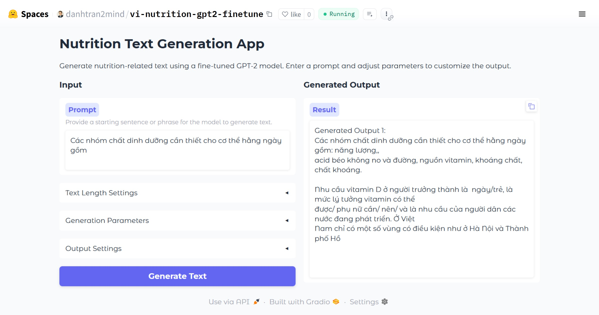

# Vietnamese Nutrition GPT2 Finetune
## Introduction  
A comprehensive textbook on nutrition in the context of rehabilitation, published by Hanoi Medical College. This resource provides detailed guidance on nutritional strategies to support functional recovery.

## Key Features
- **Specialized Nutrition**: Fine-tuned on Hanoi Medical College’s "Nutrition in Rehabilitation" for Vietnamese guidance.
- **Vietnamese Language**: Built on NlpHUST/gpt2-vietnamese for accurate text generation.
- **Interactive Demo**: Gradio interface on HuggingFace for custom input testing.
- **Customizable Output**: Adjustable parameters (max_length, temperature, etc.).
  
## Notenooks
This is the Notebook of this Project:

[](https://colab.research.google.com/github/danhtran2mind/vi-nutrition-gpt2-finetune/blob/main/notebooks/vi-nutrition-gpt2-finetune.ipynb)
[](https://studiolab.sagemaker.aws/import/github/danhtran2mind/vi-nutrition-gpt2-finetune/blob/main/notebooks/vi-nutrition-gpt2-finetune.ipynb)
[](https://deepnote.com/launch?url=https://github.com/danhtran2mind/vi-nutrition-gpt2-finetune/blob/main/notebooks/vi-nutrition-gpt2-finetune.ipynb)
[](https://mybinder.org/v2/gh/danhtran2mind/vi-nutrition-gpt2-finetune/main?filepath=notebooks/vi-nutrition-gpt2-finetune.ipynb)
[](https://mybinder.org/v2/gh/danhtran2mind/vi-nutrition-gpt2-finetune/main)
[](https://www.kaggle.com/notebooks/welcome?src=https%3A%2F%2Fgithub.com%2Fdanhtran2mind/vi-nutrition-gpt2-finetune/blob/main/notebooks/vi-nutrition-gpt2-finetune.ipynb)
[](https://github.com/danhtran2mind/vi-nutrition-gpt2-finetune/blob/main/notebooks/vi-nutrition-gpt2-finetune.ipynb)

## Dataset  
- **Metadata:**  
  - **Title:** GIÁO TRÌNH DINH DƯỠNG TRONG PHỤC HỒI CHỨC NĂNG (Nutrition in Rehabilitation)  
  - **Source:** Hanoi Medical College  
- **Content:** Textbook content available in PDF format  
- **Access:** Available at: http://lib.yhn.edu.vn/bitstream/YHN/34769/1/Dung518.pdf
  
## Base Model

`Vietnamese Nutrition GPT‑2 Finetune` builds on the pre‑trained `NlpHUST/gpt2‑vietnamese` model. It adapts the base GPT‑2 architecture to generate nutrition‑related content in Vietnamese, leveraging the robust language understanding of the original model.

Explore the underlying model and its resources on Hugging Face: [](https://huggingface.co/NlpHUST/gpt2-vietnamese).

## Demonstration
### Interactive Demo

Explore the interactive demo hosted on HuggingFace:
[](https://huggingface.co/spaces/danhtran2mind/vi-nutrition-gpt2-finetune)

Below is a screenshot of the **Vietnamese Nutrition GPT2 Finetune** Demo GUI:



## Metric  
- BLEU Score: 0.06697648712509725  
- Loss: Not specified  

## Getting Started
### Step 1: Clone the Repository
To begin, clone the `Vietnamese Nutrition GPT2 Finetune` repository to your local machine:
```bash
git clone https://github.com/danhtran2mind/vi-nutrition-gpt2-finetune
cd vi-nutrition-gpt2-finetune
```
### Step 2: Install Dependencies

Install the required dependencies using the provided requirements file:

```bash
pip install -r requirements.txt
```
## Usage
### Inference App
To run the Gradio application locally at the default address `localhost:7860`, execute:

```bash
python app.py
```
### Python API
You can use below python script to create text:
```python
import torch
from transformers import GPT2Tokenizer, GPT2LMHeadModel

def generate_nutrition_text(
    input_text,
    model_name='danhtran2mind/vi-nutrition-gpt2-finetune',
    max_length=100,
    min_length=100,
    temperature=0.7,
    top_k=40,
    top_p=0.9,
    num_beams=5,
    num_return_sequences=1,
    random_seed=42
):
    # Set random seed for reproducibility
    torch.manual_seed(random_seed)
    
    # Load the tokenizer and model
    tokenizer = GPT2Tokenizer.from_pretrained(model_name)
    model = GPT2LMHeadModel.from_pretrained(model_name)
    
    # Encode the input text
    input_ids = tokenizer.encode(input_text, return_tensors='pt')
    
    # Generate text
    sample_outputs = model.generate(
        input_ids,
        pad_token_id=tokenizer.eos_token_id,
        do_sample=True,
        max_length=max_length,
        min_length=min_length,
        temperature=temperature,
        top_k=top_k,
        top_p=top_p,
        num_beams=num_beams,
        early_stopping=True,
        no_repeat_ngram_size=2,
        num_return_sequences=num_return_sequences
    )
    
    # Decode and return the generated texts
    generated_texts = [
        tokenizer.decode(output.tolist(), skip_special_tokens=True)
        for output in sample_outputs
    ]
    
    return generated_texts

# Example usage

input_text = "Các nhóm chất dinh dưỡng cần thiết cho cơ thể hằng ngày gồm"
generated_texts = generate_nutrition_text(
    input_text,
    max_length=100,
    temperature=0.7,
    top_k=40,
    top_p=0.9,
    random_seed=42
)
for i, text in enumerate(generated_texts):
    print(f"Generate Output {i+1}:\n{text}")
```
Example Output:
```markdown
Generate Output 1:
Các nhóm chất dinh dưỡng cần thiết cho cơ thể hằng ngày gồm: năng lượng,,
acid béo không no và đường, nguồn vitamin, khoáng chất, chất khoáng.

Nhu cầu vitamin D ở người trưởng thành là  ngày/trẻ, là mức lý tưởng vitamin có thể
được/ phụ nữ cần/ nên/ và là nhu cầu của người dân các nước đang phát triển. Ở Việt
Nam chỉ có một số vùng có điều kiện như ở Hà Nội và Thành phố Hồ
```

## Dependencies Version  

### Python Version
```markdown
Version: 3.10.12  
```
### Libraries Version 
```markdown
pandas==2.2.3
numpy==1.26.4
nltk==3.2.4
torch==2.5.1
pytorch-cuda==12.1
datasets==3.3.1
tqdm==4.67.1
matplotlib==3.7.5
transformers==4.47.0
pdftotext==3.0.0
accelerate==1.2.1
```
